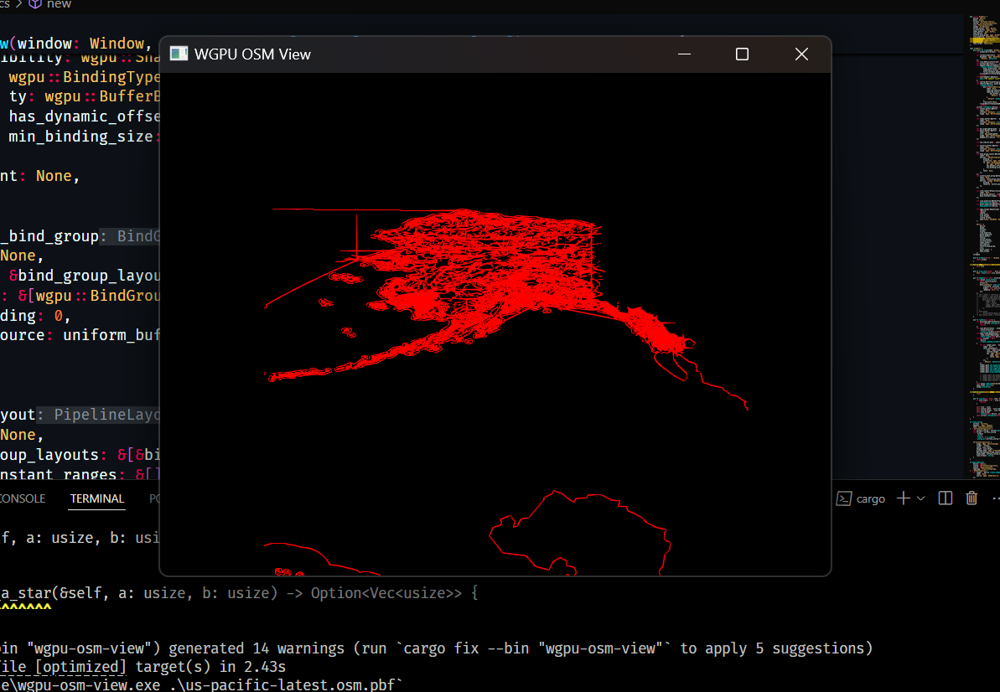

# WGPU OSM View

A high-performance OpenStreetMap viewer built with WGPU and Rust.

[](https://opensource.org/licenses/MIT)
[](https://www.rust-lang.org)
[](https://wgpu.rs)



## Table of Contents

- [WGPU OSM View](#wgpu-osm-view)
  - [Table of Contents](#table-of-contents)
  - [Installation](#installation)
  - [Usage](#usage)
  - [Features](#features)
  - [Configuration](#configuration)
  - [Contributing](#contributing)
  - [License](#license)
  - [Support](#support)

## Installation

Ensure you have Rust and Cargo installed on your system. Then, follow these steps:

1. Clone the repository:
   ```
   git clone https://github.com/yourusername/wgpu-osm-view.git
   cd wgpu-osm-view
   ```

2. Build the project:
   ```
   cargo build --release
   ```

3. Download an OpenStreetMap PBF file for your desired region and place it in the project directory.

## Usage

Run the application with:

```
cargo run --release -- <.osm file path>
```

The viewer will load the OpenStreetMap data and display it in a window. You can interact with the map using the following controls:

- Left-click and drag to pan the view
- Mouse wheel to zoom in/out
- Right-click to reset the camera

## Features

1. **Efficient OSM Data Parsing**: Quickly loads and processes large OpenStreetMap PBF files.
2. **Hardware-Accelerated Rendering**: Utilizes WGPU for fast, cross-platform graphics rendering.
3. **Intuitive Camera Controls**: Smooth panning and zooming for easy map navigation.
4. **Caching System**: Implements a smart caching mechanism to improve load times for subsequent runs.
5. **SMAA Anti-Aliasing**: Enhances visual quality with subpixel morphological anti-aliasing.

## Configuration

The project uses several configuration options that can be adjusted in the source code:

- `cell_size` in `SortedRenderData`: Controls the granularity of spatial partitioning for rendering optimization.
- `SmaaMode` in `Graphics::new()`: Adjusts the level of anti-aliasing (currently set to `Smaa1X`).
- `MAX_BUFFER_SIZE` in `Graphics::new()`: Sets the maximum allowed buffer size for vertex data.

To modify these settings, edit the corresponding values in the `main.rs` and `graphics.rs` files.

## Contributing

Contributions are welcome! Please follow these steps to contribute:

1. Fork the repository.
2. Create a new branch for your feature or bug fix.
3. Write clean, well-documented code adhering to Rust best practices.
4. Ensure all existing tests pass and add new tests for your changes.
5. Submit a pull request with a clear description of your changes.

## License

This project is licensed under the MIT License. See the [LICENSE](LICENSE) file for details.

## Support

For questions, bug reports, or feature requests, please open an issue on the [GitHub repository](https://github.com/Exotik850/wgpu-osm-view)